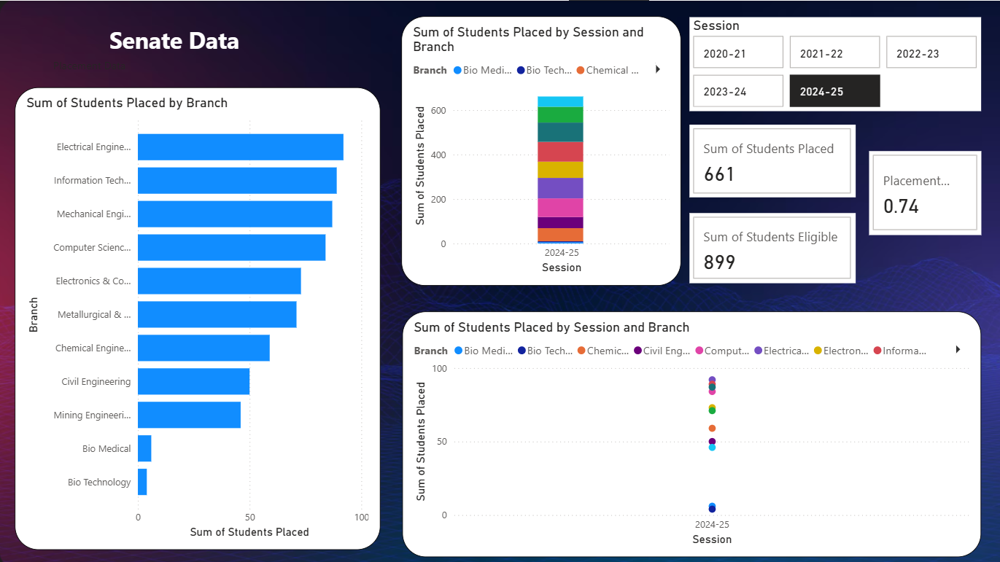
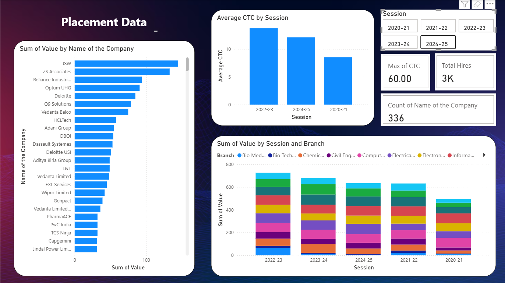

# 📊 NIT Raipur Placement Trends Dashboard(last 5 yrs)
  
**Tools Used:** Power BI, Excel (Data Cleaning), DAX

"Note: Visualization is basic"

---

## 📌 Project Overview
This project analyzes placement data of **NIT Raipur** to uncover insights into:
- Salary trends over the years
- Top recruiters and their hiring volumes
- Branch-wise placement performance

The dataset covers **[5 years]** of placement statistics, sourced from official placement and senate reports.

---

## 🗂 Dataset
The project uses **two primary datasets**:

1. **Company-wise Placement Report**
   - Fields: Company, Branch, Students Placed, CTC (LPA), Session
   - Source: NIT Raipur Placement Report 20XX–20XX

2. **Branch-wise Senate Report**
   - Fields: Branch, Students Eligible, Students Placed, Session
   - Source: NIT Raipur Senate Report 20XX–20XX

**Data Cleaning Steps:**
- Removed merged cells and formatting artifacts from Excel reports
- Unpivoted branch columns in the placement report for relational modeling
- Standardized branch names for consistency
- Ensured correct data types (numeric for CTC, integer for counts, text for categorical fields)

---

## 📈 Dashboard Highlights
The Power BI dashboard includes:
- **KPIs**:
  - Total Students Placed
  - Average Salary (LPA)
  - Highest Salary (LPA)
  - Placement Rate (%)
- **Charts**:
  - Line chart: Salary trends over sessions
  - Bar chart: Top recruiters by number of hires
  - Donut chart: Core vs IT placements
  - Branch-wise placement rates
  - Scatter plot: CTC vs Hiring Volume per company
- **Filters**:
  - Session (Year)
  - Branch

---
## 📁 Project Structure

```
```
📦 nitrrdash
├── images
  ├── dashboard_preview1.png
  ├── dashboard_preview2.png
├── powerbi
  ├── dashboard.pbix
├── processed data
  ├── placement_report.xlsx
  ├── senate_report.xlsx
├── raw data
  ├── placement_report_2020.pdf
  ├── placement_report_2021.pdf
  ├── placement_report_2022.pdf
  ├── placement_report_2023.pdf
  ├── placement_report_2024.pdf
  ├── senate_report_2020.pdf
  ├── senate_report_2021.pdf
  ├── senate_report_2022.pdf
  ├── senate_report_2023.pdf
  ├── senate_report_2024.pdf
```
©generated by [GitTree](https://github.com/sachinz25/GitTree)
```
©generated by [GitTree](https://github.com/sachinz25/GitTree)

---

## 🧪 Sample Visuals





---
